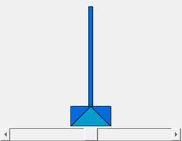
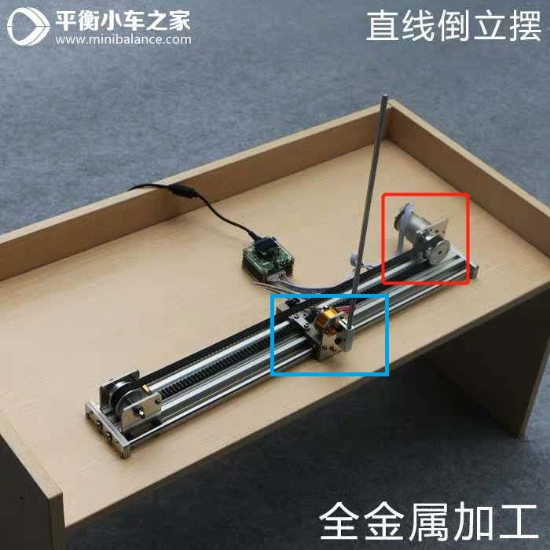

# 简介
这两个工程都是通过发送PWM控制伺服电机来保持倒立摆平稳，第一个工程仅仅保持摆直立，第二个工程在保持摆直立的前提下保证摆会回到一开始的位置。  
  
我的目的仅仅在于了解控制部分，所以不会去关注具体控制层面。我们仅仅需要知道我们是控制下图中红框圈出来的伺服电机，然后是通过发送PWM的占空比来决定伺服电机的角度，然后传送带改变底部蓝框方块的位置。
  
# 框架解析
这两个工程在main函数中都仅仅做了对外设进行了初始化ADC，编码器，电机，定时器，然后开了个10ms一次的中断。
这两个工程核心都在中断函数PIT0_ISR中，我们只需要分析PIT0_ISR这个函数就够了
# 仅直立环
```
void PIT0_ISR(void)
{
    //清中断标志位
    PIT_Flag_Clear(PIT0);

    //功能代码部分
    angle = adc_once(ADC1_SE10, ADC_10bit);     //获得当前角度

    signed_pwm = Ang_PID(angle, ANGLE_BALANCE); //根据PID获得需要纠正的角度
    if (signed_pwm > 1000)  signed_pwm = 1000;  //这两句是限制最大值和最小值
    if (signed_pwm < -1000) signed_pwm = -1000;

    if ((angle>(ANGLE_BALANCE-50)) && (angle<(ANGLE_BALANCE+50)))           //50是经验值，如果偏差超过50才进行纠正，如果偏差小于50就不纠正了
    {
        ctr_motor(-signed_pwm);
    }
    else
    {
        ctr_motor(0);
    }
}
```
整个过程每10ms检查一次角度，如果这个角度偏离到需要纠正的程度，就按照计算的PID结果进行纠正
# 直立环加位置环
```
void PIT0_ISR(void)
{
    //清中断标志位
    PIT_Flag_Clear(PIT0);

    //功能代码部分
    angle = adc_once(ADC1_SE10, ADC_10bit);                     //获得当前倒立摆的角度
    encoder_counter += ftm_quad_get(FTM2);                      //获得当前倒立摆的位置
    ftm_quad_clean(FTM2);

    signed_pwm_ang = Ang_PID(angle, ANGLE_BALANCE);             //根据PID获得如果要倒立摆直立需要纠正的角度

    static uint8 ct = 0;
    ct++;
    if (ct == 1)
    {
        signed_pwm_pos_now = Pos_PID(encoder_counter, 0);       //根据PID获得如果要倒立摆回原位需要纠正的角度
        signed_pwm_pos_delta = signed_pwm_pos_now-signed_pwm_pos_last;  //获得这次需要更新的量
        signed_pwm_pos_used = signed_pwm_pos_last+(signed_pwm_pos_delta*1/10);//关于这个的解释在底部
    }
    if (ct == 2){signed_pwm_pos_used=signed_pwm_pos_last+(signed_pwm_pos_delta*2/10);}
    if (ct == 3){signed_pwm_pos_used=signed_pwm_pos_last+(signed_pwm_pos_delta*3/10);}
    if (ct == 4){signed_pwm_pos_used=signed_pwm_pos_last+(signed_pwm_pos_delta*4/10);}
    if (ct == 5){signed_pwm_pos_used=signed_pwm_pos_last+(signed_pwm_pos_delta*5/10);}
    if (ct == 6){signed_pwm_pos_used=signed_pwm_pos_last+(signed_pwm_pos_delta*6/10);}
    if (ct == 7){signed_pwm_pos_used=signed_pwm_pos_last+(signed_pwm_pos_delta*7/10);}
    if (ct == 8){signed_pwm_pos_used=signed_pwm_pos_last+(signed_pwm_pos_delta*8/10);}
    if (ct == 9){signed_pwm_pos_used=signed_pwm_pos_last+(signed_pwm_pos_delta*9/10);}
    if (ct == 10)//1不分频 2二分频 3三分频 以此类推
    {
        ct = 0;

        signed_pwm_pos_used = signed_pwm_pos_last+(signed_pwm_pos_delta*10/10);
        signed_pwm_pos_last = signed_pwm_pos_now;
    }

    signed_pwm_all = -signed_pwm_ang + signed_pwm_pos_used;

    if (signed_pwm_all > 1000)  signed_pwm_all = 1000;
    if (signed_pwm_all < -1000) signed_pwm_all = -1000;

    if ((angle>(ANGLE_BALANCE-100)) && (angle<(ANGLE_BALANCE+100)))
    {
        ctr_motor(signed_pwm_all);
    }
    else
    {
        ctr_motor(0);
    }
}
```
程序每10ms计算一次直立环，100ms计算一次位置环，但是都是10ms进行一次控制。signed_pwm_all是结合了直立环signed_pwm_ang和位置环signed_pwm_pos_used最后下发下去让电机执行的值，signed_pwm_pos_used在程序中被分成了十次给来达到平滑的作用。  
举例：signed_pwm_pos_delta算出电机这次需要从40度转动50度最后90度能使得电机带动的方块最后处在指定位置，然后位置环分了十次下发signed_pwm_pos_used，让电机转45度，50度一直到90度。
# PID函数
仅直立环用到了Ang_PID
直立环加位置环用到了Ang_PID和Pos_PID
```
int16 Ang_PID(float measured, float target)
{
    int16 result;
    float error;
    static float error_last=0;//上次偏差
    static float error_integration=0;//偏差积分

    error=measured-target;//计算偏差
    error_integration+=error;//对偏差积分
    result=(int16)(  Kp_ang*error+Ki_ang*error_integration+Kd_ang*(error-error_last)  );
    error_last=error;//更新此值

    return result;
}
```
这个函数没有什么好讲的，标准的PID函数，Pos_PID仅仅就Kp,Kd,Ki不同，别的都一样
# 附
这些代码是我从淘宝上买的，我用来学习倒立摆用的，如果侵犯了任何人的利益，我会删除的  
